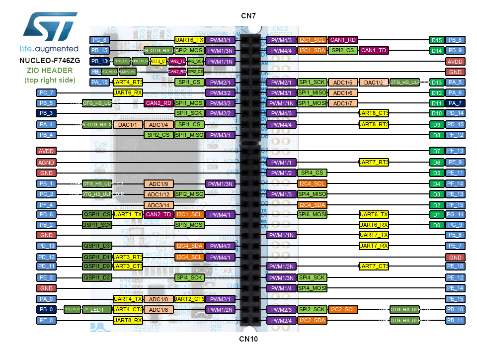

# STM32_Peripheral_Project
STM32F756ZG is a server that receives a struct from the client PC using an ethernet cable that transfers data between server and client (LWIP protocol).
The struct contains a test-ID integer the number of peripherals to test, and a string that send to the server. it's like an echo server that checks data transmission validation between UARTs, I2C, and SPI, using DMA.

# Sever
it's a UDP server, located at Main_Inner_System/Src file.

# Client
it's written in C, and it runs over the Windows system.

# Run Project
1. connect STM32F756ZG to power (not USB to computer).
2. connect STM32F756ZG to the PC using an Ethernet cable.
3. connect jumpers between UART1 and UART2 same as I2C, and SPI.
    - UART5 : TX --> PC12
              RX --> PD2
    - UART7 : TX --> PF7
              RX --> PE7
    - I2C1 (master) : SCL --> PB6
                      SDA --> PB9
    - I2C2 (slave)  : SCL --> PF1
                      SDA --> PF0
    - SPI3 (master) : SCK  --> PC10
                      MOSI --> PB2
                      MISO --> PC11
                      NSS  --> PA15
    - SPI4 (slave)  : SCK  --> PE2
                      MOSI --> PE6
                      MISO --> PE5
                      NSS  --> PE4

4. run the STM project, it will run also the server.
5. run client code on Windows.
6. select which peripheral to test: 
    1) UART
    2) I2C
    3) SPI
7. then insert an input string from a client, the message goes to the servers on an Ethernet connection to uart5 and then to uart7 back to uart1 (same as SPI and I2C), as an Echo server. this gives us an indication to check the validation of the peripherals.

_______________________________________________________________________________________________
# Client Code

    #define _WINSOCK_DEPRECATED_NO_WARNINGS
    #include <stdio.h>
    #include <stdlib.h>
    #include <string.h>
    #include <winsock2.h>

    #define SERVER_IP "192.168.7.2"  // server's IP address
    #define SERVER_PORT 50007
    #define BUFFER_SIZE 96

    #pragma pack(push, 1)
    struct Message {
        int number;
        char message[BUFFER_SIZE];
    };
    #pragma pack(pop)

    int main() {
        WSADATA wsaData;
        SOCKET clientSocket;
        struct sockaddr_in serverAddress;
        struct Message message;
        char buff[100] = { 0 };
        int bytesReceived;
        while(1){
            // Initialize Winsock
            if (WSAStartup(MAKEWORD(2, 2), &wsaData) != 0) {
                fprintf(stderr, "WSAStartup failed\n");
                return 1;
            }

            // Create socket
            clientSocket = socket(AF_INET, SOCK_DGRAM, 0);
            if (clientSocket == INVALID_SOCKET) {
                fprintf(stderr, "Socket creation failed\n");
                WSACleanup();
                return 1;
            }

            // Set server address and port
            serverAddress.sin_family = AF_INET;
            serverAddress.sin_addr.s_addr = inet_addr(SERVER_IP);
            serverAddress.sin_port = htons(SERVER_PORT);

            do {
                // Get user input
                printf("Phriferal test: \n1- UART \n2- I2C \n3- SPI \n");
                printf("Insert Here Number 1-3 an press Enter : ");
                //fgets(buffer, BUFFER_SIZE, stdin);
                //buffer[strcspn(buffer, "\n")] = '\0';  // Remove newline character
                scanf_s("%d", &message.number);
                getchar();  // Consume newline character
            } while (message.number < 1 || message.number>3);

            printf("Enter a message: ");
            fgets(message.message, BUFFER_SIZE, stdin);
            message.message[strcspn(message.message, "\n")] = '\0';  // Remove newline character

            // Send data to the server
            sendto(clientSocket, (char*)&message, sizeof(message), 0, (struct sockaddr*)&serverAddress, sizeof(serverAddress));

            // Receive response from the server
            bytesReceived = recvfrom(clientSocket, (char*)buff, sizeof(message), 0, NULL, NULL);
            if (bytesReceived == SOCKET_ERROR) {
                fprintf(stderr, "Error receiving data\n");
                closesocket(clientSocket);
                WSACleanup();
                return 1;
            }

            // Print the response
            printf("Received message from server = %s\n", buff);

            // Close the socket and cleanup
            closesocket(clientSocket);
            WSACleanup();
            printf("________________________________________________________\n");
        }

        return 0;
    }
_______________________________________________________________________________________________

